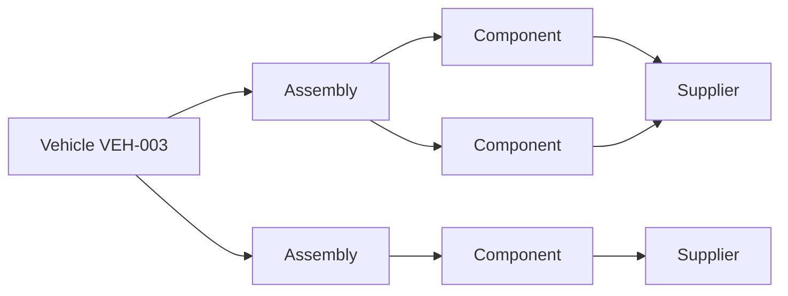
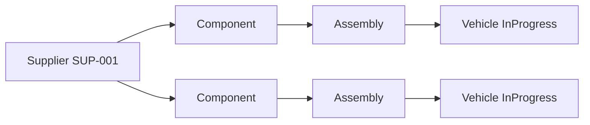
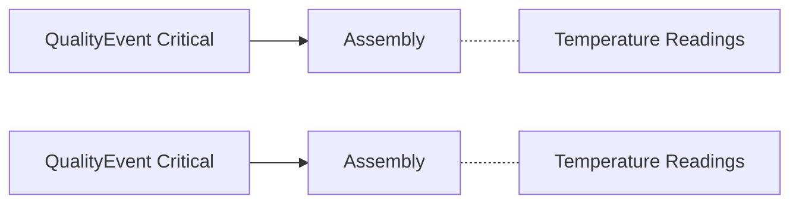
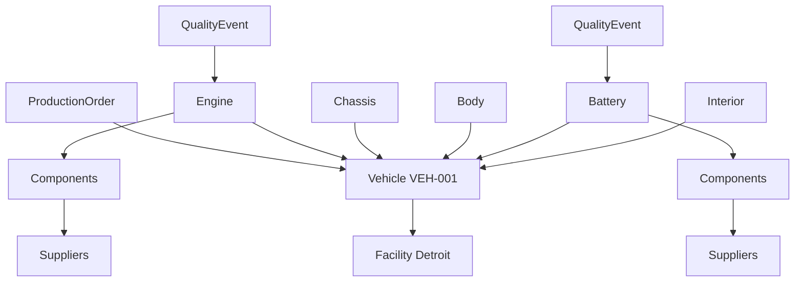

# Demo Questions - Automotive Manufacturing & Supply Chain

This document contains 5 business questions demonstrating graph traversal capabilities for NextGen Motors' automotive manufacturing and supply chain ontology.

---

## Question 1: Supply Chain Traceability (3+ Hops)

### Business Question

> "A quality defect was found in Vehicle VEH-003. Which suppliers provided components used in its assemblies?"

### Why It Matters

When a quality issue is discovered in a finished vehicle, tracing back through the assembly to identify all component suppliers is critical for:
- Root cause analysis
- Supplier quality scoring
- Potential recall scope assessment

### Graph Traversal

```
Vehicle (VEH-003) ← Assembly ← Component ← Supplier
```



### GQL Query

```gql
MATCH (v:Vehicle {VehicleId: 'VEH-003'})<-[:ASSEMBLED_INTO]-(a:Assembly)-[:USES_COMPONENT]->(c:Component)-[:SUPPLIED_BY]->(s:Supplier)
RETURN DISTINCT s.SupplierId, s.Supplier_Name, s.Supplier_Country, s.Supplier_Rating, 
       COUNT(DISTINCT c) AS ComponentCount
```

### Expected Results

| SupplierId | Supplier_Name | Supplier_Country | Supplier_Rating | ComponentCount |
|------------|---------------|------------------|-----------------|----------------|
| SUP-001 | VoltPower Energy Systems | China | 4.5 | 2 |
| SUP-002 | ElectroDrive Components | Germany | 4.8 | 2 |
| SUP-004 | SteelFrame Industries | USA | 4.6 | 3 |
| SUP-005 | AutoMotion Parts | Japan | 4.9 | 3 |

### Why Ontology is Better

**Traditional Approach**: Requires 4 separate SQL queries with JOINs across Vehicle, Assembly, EdgeAssemblyComponent, Component, and Supplier tables. Complex to write and maintain.

**Ontology Approach**: Single graph traversal expressing the business relationship naturally. The path `Vehicle ← Assembly → Component → Supplier` matches how engineers think about traceability.

---

## Question 2: Supply Chain Risk Assessment (4 Hops)

### Business Question

> "If Supplier SUP-001 (VoltPower Energy Systems) experiences a production halt, which vehicles currently in production are at risk?"

### Why It Matters

Supply chain disruption analysis requires understanding:
- Which components come from the affected supplier
- Which assemblies use those components
- Which vehicles need those assemblies
- Production timeline impact

### Graph Traversal

```
Supplier (SUP-001) ← Component ← Assembly → Vehicle
```



### GQL Query

```gql
MATCH (s:Supplier {SupplierId: 'SUP-001'})<-[:SUPPLIED_BY]-(c:Component)<-[:USES_COMPONENT]-(a:Assembly)-[:ASSEMBLED_INTO]->(v:Vehicle)
FILTER v.Vehicle_Status IN ['InProgress', 'Planned']
RETURN DISTINCT v.VehicleId, v.Vehicle_VIN, v.Vehicle_Model, v.Vehicle_Status,
       COLLECT(DISTINCT c.Component_Name) AS AffectedComponents
```

### Expected Results

| VehicleId | Vehicle_VIN | Vehicle_Model | Vehicle_Status | AffectedComponents |
|-----------|-------------|---------------|----------------|-------------------|
| VEH-004 | 1NGEV2024THUND002 | Thunder SUV | InProgress | [Lithium Battery Cell, Electric Motor] |
| VEH-007 | 1NGEV2024STORM01 | Storm Truck | InProgress | [Lithium Battery Cell, Electric Motor] |
| VEH-012 | 1NGEV2024SPARK004 | Spark EV | InProgress | [Lithium Battery Cell, Electric Motor] |

### Why Ontology is Better

**Traditional Approach**: Requires understanding the complete data model, writing complex JOINs with subqueries, and filtering at multiple levels.

**Ontology Approach**: Express the impact path naturally. The query reads like the business question: "From supplier, through components, through assemblies, to vehicles."

---

## Question 3: Quality Correlation with Timeseries (2 Hops + Timeseries)

### Business Question

> "For assemblies that had Critical quality events, what were the temperature readings during manufacturing?"

### Why It Matters

Correlating quality defects with operational telemetry helps identify:
- Process conditions leading to defects
- Temperature thresholds that cause problems
- Predictive maintenance opportunities

### Graph Traversal

```
QualityEvent (Critical) → Assembly [+ Timeseries: Temperature]
```



### GQL Query

```gql
MATCH (q:QualityEvent)-[:AFFECTS]->(a:Assembly)
FILTER q.Event_Severity = 'Critical'
RETURN a.AssemblyId, a.Assembly_Type, 
       q.EventId, q.Event_Description,
       a.Temperature, a.Torque, a.Timestamp
ORDER BY a.Timestamp
```

### Expected Results

| AssemblyId | Assembly_Type | EventId | Event_Description | Temperature | Torque | Timestamp |
|------------|---------------|---------|-------------------|-------------|--------|-----------|
| ASM-027 | Chassis | EVT-007 | Brake system pressure test failure | 43.8 | 118.5 | 2025-11-10T06:45:00 |
| ASM-011 | Engine | EVT-008 | ADAS sensor calibration issue | 48.5 | 130.2 | 2025-11-11T09:15:00 |
| ASM-019 | Battery | EVT-028 | Airbag deployment sensor fault | 53.5 | 86.2 | 2025-11-09T14:15:00 |

### Why Ontology is Better

**Traditional Approach**: Requires JOINing quality event tables with telemetry tables based on time windows and entity keys. Complex temporal alignment.

**Ontology Approach**: Timeseries data is automatically contextualized to entities. Query the entity and its metrics flow naturally.

---

## Question 4: Logistics and Component Traceability (3 Hops)

### Business Question

> "Which shipments delivered components to our Detroit facility (FAC-001) in November 2025, and what was their origin?"

### Why It Matters

Understanding inbound logistics helps:
- Track component provenance
- Identify transportation delays affecting production
- Optimize supplier-to-plant logistics

### Graph Traversal

```
Facility (FAC-001) ← Shipment → Facility (Origin) + Component
```

```mermaid
graph LR
    D[Detroit FAC-001] <-- DELIVERED_TO --- SH1[Shipment]
    D <-- DELIVERED_TO --- SH2[Shipment]
    SH1 -- ORIGINATED_FROM --> O1[Origin Facility]
    SH2 -- ORIGINATED_FROM --> O2[Origin Facility]
    SH1 -- SHIPS_COMPONENT --> C1[Components]
    SH2 -- SHIPS_COMPONENT --> C2[Components]
```

### GQL Query

```gql
MATCH (dest:Facility {FacilityId: 'FAC-001'})<-[:DELIVERED_TO]-(sh:Shipment)-[:ORIGINATED_FROM]->(origin:Facility)
FILTER sh.Shipment_ArrivalDate >= zoned_datetime('2025-11-01T00:00:00Z') 
  AND sh.Shipment_ArrivalDate < zoned_datetime('2025-12-01T00:00:00Z')
MATCH (sh)-[:SHIPS_COMPONENT]->(c:Component)
RETURN sh.ShipmentId, sh.Shipment_TrackingNum, sh.Shipment_Status, sh.Shipment_Carrier,
       origin.Facility_Name AS OriginFacility,
       COLLECT(c.Component_Name) AS Components
```

### Expected Results

| ShipmentId | TrackingNum | Status | Carrier | OriginFacility | Components |
|------------|-------------|--------|---------|----------------|------------|
| SHP-003 | TRK-2025-001003 | Delivered | RapidTruck | WireConnect Monterrey | [Onboard Charger, Wiring Harness, LED Headlight] |
| SHP-004 | TRK-2025-001004 | Delivered | RailExpress | SteelFrame Ohio Works | [Steel Frame, Aluminum Body Panel, Glass Windshield] |
| SHP-011 | TRK-2025-001011 | Delivered | RapidTruck | Central Distribution Hub | [Lithium Battery Cell, Steel Frame, Suspension System] |

### Why Ontology is Better

**Traditional Approach**: Multiple self-joins on facility table (once for origin, once for destination), plus joins to shipment-component mapping.

**Ontology Approach**: Named relationships (ORIGINATED_FROM, DELIVERED_TO) make direction clear. No self-join complexity.

---

## Question 5: End-to-End Vehicle Genealogy (4+ Hops)

### Business Question

> "For Vehicle VEH-001 (Spark EV), show the complete manufacturing genealogy: production order, assemblies, components, suppliers, and any quality events."

### Why It Matters

Complete product genealogy is essential for:
- Regulatory compliance (e.g., NHTSA, EPA)
- Warranty claims investigation
- Customer inquiries about vehicle history

### Graph Traversal

```
ProductionOrder → Vehicle ← Assembly → Component → Supplier
                         ← QualityEvent
```



### GQL Query

```gql
MATCH (po:ProductionOrder)-[:ORDERED_FOR]->(v:Vehicle {VehicleId: 'VEH-001'})-[:PRODUCED_AT]->(f:Facility)
MATCH (v)<-[:ASSEMBLED_INTO]-(a:Assembly)
MATCH (a)-[:USES_COMPONENT]->(c:Component)-[:SUPPLIED_BY]->(s:Supplier)
RETURN v.VehicleId, v.Vehicle_VIN, v.Vehicle_Model,
       po.Order_Number, po.Order_Priority,
       f.Facility_Name,
       a.Assembly_Type,
       COLLECT(DISTINCT c.Component_Name) AS Components,
       COLLECT(DISTINCT s.Supplier_Name) AS Suppliers
```

### Expected Results (Simplified)

| VehicleId | VIN | Model | Order | Facility | Assemblies |
|-----------|-----|-------|-------|----------|------------|
| VEH-001 | 1NGEV2024SPARK001 | Spark EV | PO-2025-0001 | NextGen Motors Detroit | Engine, Chassis, Body, Battery, Interior |

**Detailed Genealogy:**
- **Engine (ASM-001)**: Electric Motor, Power Inverter, Thermal Management, Cooling System → VoltPower, ElectroDrive, ThermoTech
- **Battery (ASM-004)**: Lithium Battery Cell, Battery Management System, Thermal Management → VoltPower, ElectroDrive, ThermoTech
- **Quality Events**: Inspection (ASM-001), Defect - replaced component (ASM-004)

### Why Ontology is Better

**Traditional Approach**: Would require 8+ table JOINs, multiple subqueries, and complex aggregation logic. Extremely difficult to maintain.

**Ontology Approach**: The graph naturally represents the complete product structure. Traversal captures all relationships in one cohesive query that matches how manufacturing engineers conceptualize vehicle build genealogy.

---

## Data Agent Instructions

### GQL Syntax Requirements for Fabric Graph
When generating GQL queries with aggregations:
1. **Use LET for GROUP BY columns**: Property access (`node.Property`) is NOT allowed in GROUP BY. First assign properties to variables using `LET`, then use those variables in GROUP BY.
2. **Use FILTER instead of WHERE**: For filtering after MATCH, use `FILTER` statement.
3. **Use zoned_datetime()**: For datetime literals, use `zoned_datetime('2025-01-10T00:00:00Z')` NOT `datetime()`.
4. **No OPTIONAL MATCH**: This is not supported in Fabric Graph.
5. **GROUP BY is required with aggregations**: When using `count()`, `sum()`, `avg()`, etc., all non-aggregated columns must be in GROUP BY.

**Example pattern:**
```gql
MATCH (n:Node)-[:REL]->(m:Other)
FILTER n.property = 'value'
LET nodeName = n.Name
LET otherName = m.Name  
RETURN nodeName, otherName, count(*) AS total
GROUP BY nodeName, otherName
ORDER BY total DESC
```

When using AI assistants to query this ontology:

### Entity Reference
- Vehicle: Final product (VEH-###)
- Assembly: Major component groups (ASM-###) - Engine, Chassis, Body, Battery, Interior
- Component: Parts (CMP-###)
- Supplier: Vendors (SUP-###)
- Facility: Locations (FAC-###)
- ProductionOrder: Work orders (ORD-###)
- QualityEvent: Quality records (EVT-###)
- Shipment: Logistics (SHP-###)

### Key Relationships
- Assembly -[ASSEMBLED_INTO]-> Vehicle
- Assembly -[USES_COMPONENT]-> Component
- Component -[SUPPLIED_BY]-> Supplier
- Vehicle -[PRODUCED_AT]-> Facility
- QualityEvent -[AFFECTS]-> Assembly
- Shipment -[ORIGINATED_FROM]-> Facility
- Shipment -[DELIVERED_TO]-> Facility
- Shipment -[SHIPS_COMPONENT]-> Component
- Supplier -[OPERATES_FROM]-> Facility
- ProductionOrder -[ORDERED_FOR]-> Vehicle

### Timeseries Properties
- **Assembly**: Temperature (°C), Torque (Nm), CycleTime (sec)
- **Facility**: EnergyConsumption (kWh), Humidity (%), ProductionRate (units/hr)

### Query Tips
1. Use `DISTINCT` when aggregating across many-to-many relationships
2. Use `FILTER` statement for filtering (not WHERE after MATCH)
3. Use `zoned_datetime()` for datetime comparisons
4. Use `LET` to assign properties to variables before using in GROUP BY
5. Use COLLECT() to aggregate related items
6. Timeseries queries can include timestamp ordering
