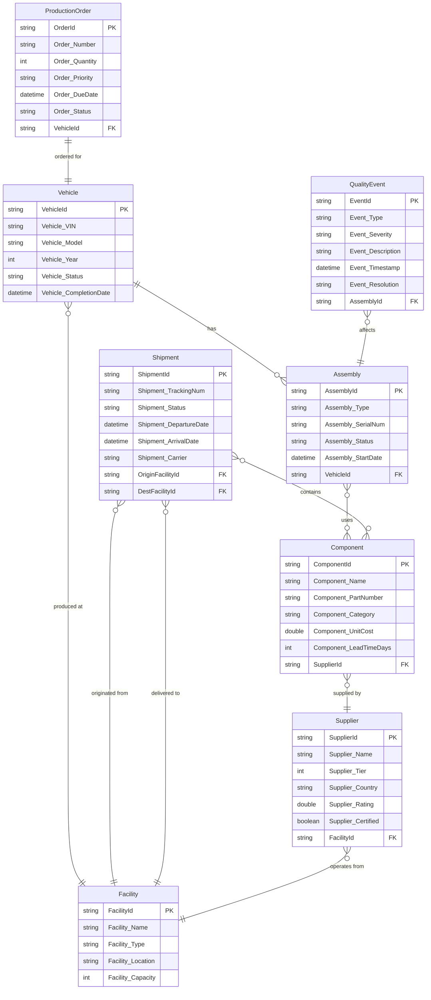

# Ontology Structure - Automotive Manufacturing & Supply Chain

## Overview

This ontology models an automotive manufacturing ecosystem connecting **NextGen Motors** production facilities with their supply chain network. It enables end-to-end traceability from raw materials through suppliers to finished vehicles.

---

## Entity Definitions

| Entity | Key | Key Type | Description | Binding Source |
|--------|-----|----------|-------------|----------------|
| **Vehicle** | VehicleId | string | Final assembled vehicle with VIN tracking | Lakehouse: DimVehicle |
| **Assembly** | AssemblyId | string | Major vehicle assemblies (engine, chassis, body) | Lakehouse: DimAssembly, Eventhouse: AssemblyTelemetry |
| **Component** | ComponentId | string | Parts and sub-assemblies used in manufacturing | Lakehouse: DimComponent |
| **Supplier** | SupplierId | string | Tier 1/Tier 2 suppliers providing components | Lakehouse: DimSupplier |
| **Facility** | FacilityId | string | Manufacturing plants, warehouses, distribution centers | Lakehouse: DimFacility, Eventhouse: FacilityTelemetry |
| **ProductionOrder** | OrderId | string | Work orders for vehicle production batches | Lakehouse: DimProductionOrder |
| **QualityEvent** | EventId | string | Quality inspections, defects, recalls | Lakehouse: FactQualityEvent |
| **Shipment** | ShipmentId | string | Logistics movements between facilities | Lakehouse: FactShipment |

---

## Entity Properties

### Vehicle
| Property | Type | Description |
|----------|------|-------------|
| VehicleId | string | Unique VIN-based identifier |
| Vehicle_VIN | string | Vehicle Identification Number |
| Vehicle_Model | string | Model name (e.g., Spark EV, Thunder SUV) |
| Vehicle_Year | int | Production year |
| Vehicle_Status | string | Production status (InProgress, Complete, Shipped) |
| Vehicle_CompletionDate | datetime | Date vehicle completed assembly |

### Assembly
| Property | Type | Description |
|----------|------|-------------|
| AssemblyId | string | Unique assembly identifier |
| Assembly_Type | string | Type (Engine, Chassis, Body, Battery, Interior) |
| Assembly_SerialNum | string | Serial number |
| Assembly_Status | string | Status (Pending, InProgress, Complete, QCPassed) |
| Assembly_StartDate | datetime | Assembly start timestamp |
| *Temperature* | double | *(Timeseries)* Assembly temperature in °C |
| *Torque* | double | *(Timeseries)* Torque measurement in Nm |
| *CycleTime* | double | *(Timeseries)* Cycle time in seconds |

### Component
| Property | Type | Description |
|----------|------|-------------|
| ComponentId | string | Unique component identifier |
| Component_Name | string | Component name |
| Component_PartNumber | string | Part number |
| Component_Category | string | Category (Electrical, Mechanical, Safety) |
| Component_UnitCost | double | Cost per unit |
| Component_LeadTimeDays | int | Supplier lead time in days |

### Supplier
| Property | Type | Description |
|----------|------|-------------|
| SupplierId | string | Unique supplier identifier |
| Supplier_Name | string | Company name |
| Supplier_Tier | int | Tier level (1 or 2) |
| Supplier_Country | string | Country of origin |
| Supplier_Rating | double | Quality rating (0-5) |
| Supplier_Certified | boolean | ISO certification status |

### Facility
| Property | Type | Description |
|----------|------|-------------|
| FacilityId | string | Unique facility identifier |
| Facility_Name | string | Facility name |
| Facility_Type | string | Type (Assembly, Warehouse, Distribution) |
| Facility_Location | string | City, Country |
| Facility_Capacity | int | Annual production capacity |
| *EnergyConsumption* | double | *(Timeseries)* Energy usage in kWh |
| *Humidity* | double | *(Timeseries)* Relative humidity % |
| *ProductionRate* | double | *(Timeseries)* Units per hour |

### ProductionOrder
| Property | Type | Description |
|----------|------|-------------|
| OrderId | string | Unique order identifier |
| Order_Number | string | Order reference number |
| Order_Quantity | int | Ordered quantity |
| Order_Priority | string | Priority (Normal, High, Rush) |
| Order_DueDate | datetime | Target completion date |
| Order_Status | string | Status (Planned, InProgress, Complete) |

### QualityEvent
| Property | Type | Description |
|----------|------|-------------|
| EventId | string | Unique event identifier |
| Event_Type | string | Type (Inspection, Defect, Recall, Audit) |
| Event_Severity | string | Severity (Minor, Major, Critical) |
| Event_Description | string | Description of event |
| Event_Timestamp | datetime | When event occurred |
| Event_Resolution | string | Resolution status |

### Shipment
| Property | Type | Description |
|----------|------|-------------|
| ShipmentId | string | Unique shipment identifier |
| Shipment_TrackingNum | string | Tracking number |
| Shipment_Status | string | Status (Pending, InTransit, Delivered) |
| Shipment_DepartureDate | datetime | Departure timestamp |
| Shipment_ArrivalDate | datetime | Expected/actual arrival |
| Shipment_Carrier | string | Logistics carrier name |

---

## Relationships

| Relationship | Source Entity | Target Entity | Cardinality | Source Table |
|--------------|---------------|---------------|-------------|--------------|
| ASSEMBLED_INTO | Assembly | Vehicle | Many-to-One | DimAssembly |
| USES_COMPONENT | Assembly | Component | Many-to-Many | EdgeAssemblyComponent |
| SUPPLIED_BY | Component | Supplier | Many-to-One | DimComponent |
| PRODUCED_AT | Vehicle | Facility | Many-to-One | DimVehicle |
| ORDERED_FOR | ProductionOrder | Vehicle | One-to-One | DimProductionOrder |
| AFFECTS | QualityEvent | Assembly | Many-to-One | FactQualityEvent |
| ORIGINATED_FROM | Shipment | Facility | Many-to-One | FactShipment |
| DELIVERED_TO | Shipment | Facility | Many-to-One | FactShipment |
| CONTAINS | Shipment | Component | Many-to-Many | EdgeShipmentComponent |
| OPERATES_FROM | Supplier | Facility | Many-to-One | DimSupplier |

---

## Entity Relationship Diagram



---

## Multi-Hop Traversal Examples

### 1. Defect to Supplier Trace (4 hops)
**Scenario**: A quality defect is found in a vehicle. Trace back to identify the supplier.

```
QualityEvent → Assembly → Component → Supplier
```

**Path**: Start with defect event → find affected assembly → identify components used → find supplier

### 2. Supply Chain Risk Assessment (4 hops)
**Scenario**: A supplier facility experiences a disruption. Identify all vehicles at risk.

```
Facility → Supplier → Component → Assembly → Vehicle
```

**Path**: Start with impacted facility → find suppliers operating there → components they provide → assemblies using those components → vehicles affected

### 3. Production Order Fulfillment (3 hops)
**Scenario**: Track production order through to vehicle completion.

```
ProductionOrder → Vehicle → Assembly → Component
```

**Path**: Start with order → find vehicle being produced → assemblies needed → components required

### 4. Shipment Impact Analysis (3 hops)
**Scenario**: A shipment is delayed. Which production lines are affected?

```
Shipment → Component → Assembly → Vehicle
```

**Path**: Start with shipment → components in transit → assemblies waiting for parts → vehicles delayed

---

## Notes

- **Timeseries Properties**: Assembly (Temperature, Torque, CycleTime) and Facility (EnergyConsumption, Humidity, ProductionRate) have timeseries data stored in Eventhouse
- **Edge Tables**: EdgeAssemblyComponent and EdgeShipmentComponent handle many-to-many relationships
- **Facility Dual Role**: Facilities serve as both production sites and supplier operating locations
