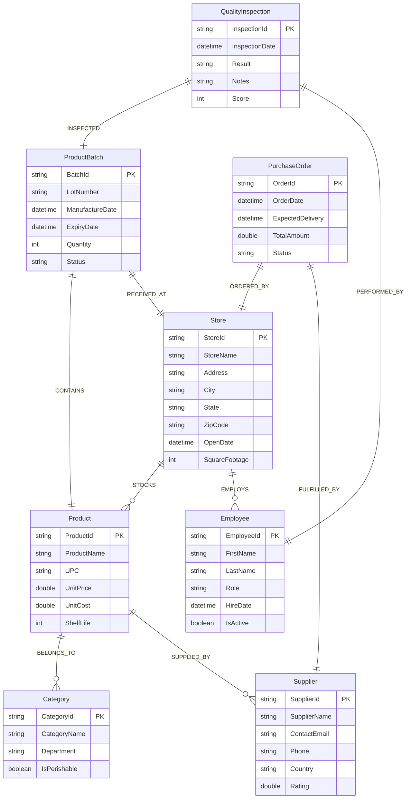

# FreshMart Supermarket - Ontology Structure

> **Version**: 1.0  
> **Domain**: Retail / Grocery Supply Chain  
> **Last Updated**: January 2026

---

## Entity Definitions

| Entity | Key | Key Type | Properties | Binding Source |
|--------|-----|----------|------------|----------------|
| **Store** | StoreId | string | StoreName, Address, City, State, ZipCode, OpenDate, SquareFootage | Lakehouse: DimStore |
| **Product** | ProductId | string | ProductName, UPC, UnitPrice, UnitCost, ShelfLife | Lakehouse: DimProduct |
| **Supplier** | SupplierId | string | SupplierName, ContactEmail, Phone, Country, Rating | Lakehouse: DimSupplier |
| **ProductBatch** | BatchId | string | LotNumber, ManufactureDate, ExpiryDate, Quantity, Status | Lakehouse: DimProductBatch |
| **Category** | CategoryId | string | CategoryName, Department, IsPerishable | Lakehouse: DimCategory |
| **Employee** | EmployeeId | string | FirstName, LastName, Role, HireDate, IsActive | Lakehouse: DimEmployee |
| **PurchaseOrder** | OrderId | string | OrderDate, ExpectedDelivery, TotalAmount, Status | Lakehouse: FactPurchaseOrder |
| **QualityInspection** | InspectionId | string | InspectionDate, Result, Notes, Score | Lakehouse: FactQualityInspection |

---

## Relationship Definitions

| Relationship | Source Entity | Target Entity | Source Table | Description |
|--------------|---------------|---------------|--------------|-------------|
| BELONGS_TO | Product | Category | DimProduct | Product classification hierarchy |
| SUPPLIED_BY | Product | Supplier | DimProduct | Which supplier provides each product |
| STOCKS | Store | Product | FactStoreInventory | Products available at each store |
| EMPLOYS | Store | Employee | DimEmployee | Staff assignments to stores |
| CONTAINS | ProductBatch | Product | DimProductBatch | Which product is in this batch |
| RECEIVED_AT | ProductBatch | Store | DimProductBatch | Store that received the batch |
| ORDERED_BY | PurchaseOrder | Store | FactPurchaseOrder | Which store placed the order |
| FULFILLED_BY | PurchaseOrder | Supplier | FactPurchaseOrder | Supplier fulfilling the order |
| INSPECTED | QualityInspection | ProductBatch | FactQualityInspection | Quality check performed on batch |
| PERFORMED_BY | QualityInspection | Employee | FactQualityInspection | Employee who conducted inspection |

---

## Timeseries Properties

### Store Timeseries (Eventhouse: StoreTelemetry)

| Property | Type | Description |
|----------|------|-------------|
| FootTraffic | int | Hourly customer count |
| SalesVelocity | double | Units sold per hour |
| AvgTransactionValue | double | Average basket value ($) |

### ProductBatch Timeseries (Eventhouse: BatchTelemetry)

| Property | Type | Description |
|----------|------|-------------|
| StorageTemperature | double | Temperature in Celsius |
| Humidity | double | Relative humidity % |
| DaysToExpiry | int | Days remaining until expiry |

---

## Entity-Relationship Diagram



---

## Multi-Hop Traversal Examples

### 1. Food Recall Traceability (4 hops)
**Question**: "Which stores received batches of products from a specific supplier?"

```
Supplier → (SUPPLIED_BY) ← Product → (CONTAINS) ← ProductBatch → (RECEIVED_AT) → Store
```

**Use Case**: When a supplier issues a recall, identify all affected stores.

### 2. Quality Chain Analysis (4 hops)
**Question**: "Which suppliers have products with failed quality inspections?"

```
QualityInspection → (INSPECTED) → ProductBatch → (CONTAINS) → Product → (SUPPLIED_BY) → Supplier
```

**Use Case**: Identify suppliers with recurring quality issues.

### 3. Inventory Optimization (3 hops)
**Question**: "What categories of products are stocked at stores with high foot traffic?"

```
Store → (STOCKS) → Product → (BELONGS_TO) → Category
```

**Use Case**: Optimize product mix based on store performance.

### 4. Employee Accountability (3 hops)
**Question**: "Which employees at a store have performed quality inspections on expiring batches?"

```
Store → (EMPLOYS) → Employee → (PERFORMED_BY) ← QualityInspection → (INSPECTED) → ProductBatch
```

**Use Case**: Track inspection compliance and employee performance.

### 5. Supply Chain End-to-End (5 hops)
**Question**: "Trace a quality issue from inspection back to the original supplier and purchase order"

```
QualityInspection → ProductBatch → Product → Supplier → (FULFILLED_BY) ← PurchaseOrder → Store
```

**Use Case**: Complete genealogy for compliance audits.

---

## Data Volume Recommendations

| Table | Recommended Rows | Notes |
|-------|------------------|-------|
| DimStore | 10-15 | Regional store network |
| DimProduct | 25-30 | Mix of categories |
| DimSupplier | 8-12 | Diverse supplier base |
| DimProductBatch | 40-50 | Multiple batches per product |
| DimCategory | 6-8 | Major grocery departments |
| DimEmployee | 20-25 | 2-3 per store |
| FactPurchaseOrder | 30-40 | Orders across stores |
| FactQualityInspection | 25-35 | Inspections on batches |
| FactStoreInventory | 60-80 | Store-product combinations |
| StoreTelemetry | 50+ | Hourly metrics |
| BatchTelemetry | 50+ | Storage monitoring |
