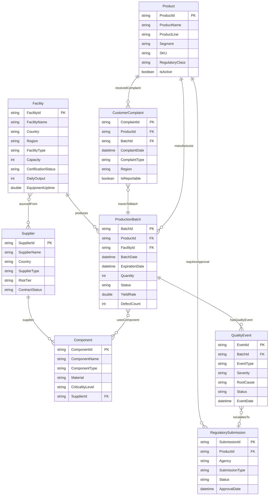

# BD Medical Manufacturing Ontology Structure

## Overview

This ontology models Becton Dickinson's medical device manufacturing operations, enabling graph-based traceability from raw materials to post-market surveillance.

**Domain:** Medical Device Manufacturing & Quality Management  
**Target Audience:** Supply Chain Analysts, Quality Engineers, Regulatory Affairs  
**Multi-hop Depth:** Up to 4 relationships  

---

## Entity Types

### 1. Product
Medical devices manufactured by BD across three business segments.

| Property | Type | Binding | Description |
|----------|------|---------|-------------|
| **ProductId** | string | Key | Unique product identifier |
| ProductName | string | Static | Device name (e.g., "BD Insyte Autoguard") |
| ProductLine | string | Static | Product family |
| Segment | string | Static | BD Medical / BD Life Sciences / BD Interventional |
| SKU | string | Static | Stock keeping unit |
| UnitOfMeasure | string | Static | Box, Case, Each |
| RegulatoryClass | string | Static | Class I, II, III (FDA) |
| IsActive | boolean | Static | Currently manufactured |

### 2. ProductionBatch
Manufacturing lot with full traceability for recalls and quality events.

| Property | Type | Binding | Description |
|----------|------|---------|-------------|
| **BatchId** | string | Key | Unique batch/lot number |
| ProductId | string | Static | FK to Product |
| FacilityId | string | Static | FK to Facility |
| BatchDate | datetime | Static | Manufacturing date |
| ExpirationDate | datetime | Static | Product expiry |
| Quantity | int | Static | Units produced |
| Status | string | Static | Released / Quarantine / Rejected |
| YieldRate | double | Timeseries | Production yield % |
| DefectCount | int | Timeseries | Defects detected |
| CycleTimeMin | double | Timeseries | Manufacturing cycle time |

### 3. Facility
BD manufacturing plants worldwide.

| Property | Type | Binding | Description |
|----------|------|---------|-------------|
| **FacilityId** | string | Key | Unique facility code |
| FacilityName | string | Static | Plant name |
| Country | string | Static | Location country |
| Region | string | Static | Americas / EMEA / APAC |
| FacilityType | string | Static | Manufacturing / Assembly / Distribution |
| Capacity | int | Static | Annual production capacity |
| CertificationStatus | string | Static | ISO 13485 / FDA Registered |
| DailyOutput | int | Timeseries | Units produced per day |
| EquipmentUptime | double | Timeseries | Equipment availability % |

### 4. Supplier
Raw material and component vendors.

| Property | Type | Binding | Description |
|----------|------|---------|-------------|
| **SupplierId** | string | Key | Unique supplier code |
| SupplierName | string | Static | Company name |
| Country | string | Static | Headquarters country |
| SupplierType | string | Static | Raw Material / Component / Packaging |
| RiskTier | string | Static | Critical / High / Medium / Low |
| ContractStatus | string | Static | Active / Under Review / Terminated |

### 5. Component
Parts and materials used in device assembly.

| Property | Type | Binding | Description |
|----------|------|---------|-------------|
| **ComponentId** | string | Key | Unique component code |
| ComponentName | string | Static | Part name |
| ComponentType | string | Static | Needle / Plunger / Tubing / Packaging |
| Material | string | Static | Stainless Steel / Polypropylene / Silicone |
| CriticalityLevel | string | Static | Critical / Standard |
| SupplierId | string | Static | FK to Supplier |

### 6. QualityEvent
Non-conformances, CAPAs, deviations, and inspections.

| Property | Type | Binding | Description |
|----------|------|---------|-------------|
| **EventId** | string | Key | Unique event identifier |
| BatchId | string | Static | FK to ProductionBatch |
| EventType | string | Static | NCR / CAPA / Deviation / Inspection |
| Severity | string | Static | Critical / Major / Minor |
| RootCause | string | Static | Root cause category |
| Status | string | Static | Open / In Progress / Closed |
| EventDate | datetime | Static | Date identified |
| ResolutionDate | datetime | Static | Date resolved |

### 7. RegulatorySubmission
FDA, CE Mark, and other regulatory filings.

| Property | Type | Binding | Description |
|----------|------|---------|-------------|
| **SubmissionId** | string | Key | Submission tracking number |
| ProductId | string | Static | FK to Product |
| Agency | string | Static | FDA / EU MDR / Health Canada / TGA |
| SubmissionType | string | Static | 510(k) / PMA / CE Mark / De Novo |
| Status | string | Static | Submitted / Under Review / Approved / Rejected |
| SubmissionDate | datetime | Static | Filing date |
| ApprovalDate | datetime | Static | Clearance date |

### 8. CustomerComplaint
Post-market surveillance and adverse event tracking.

| Property | Type | Binding | Description |
|----------|------|---------|-------------|
| **ComplaintId** | string | Key | Complaint tracking number |
| ProductId | string | Static | FK to Product |
| BatchId | string | Static | FK to ProductionBatch (if traceable) |
| ComplaintDate | datetime | Static | Date received |
| ComplaintType | string | Static | Device Malfunction / Injury / Death |
| Region | string | Static | Complaint origin region |
| IsReportable | boolean | Static | MDR reportable event |
| Status | string | Static | Open / Investigating / Closed |

---

## Relationship Types

| # | Relationship | Source → Target | Cardinality | Source Table | Description |
|---|--------------|-----------------|-------------|--------------|-------------|
| 1 | **produces** | Facility → ProductionBatch | 1:N | DimProductionBatch | Factory produces batches |
| 2 | **manufactures** | ProductionBatch → Product | N:1 | DimProductionBatch | Batch creates product |
| 3 | **supplies** | Supplier → Component | 1:N | DimComponent | Vendor provides components |
| 4 | **usesComponent** | ProductionBatch → Component | N:N | FactBatchComponent | Batch consumes components |
| 5 | **hasQualityEvent** | ProductionBatch → QualityEvent | 1:N | FactQualityEvent | Batch linked to quality issues |
| 6 | **requiresApproval** | Product → RegulatorySubmission | 1:N | DimRegulatorySubmission | Product needs clearance |
| 7 | **receivedComplaint** | Product → CustomerComplaint | 1:N | FactCustomerComplaint | Post-market complaints |
| 8 | **tracesToBatch** | CustomerComplaint → ProductionBatch | N:1 | FactCustomerComplaint | Complaint traced to batch |
| 9 | **sourcedFrom** | Facility → Supplier | N:N | FactFacilitySupplier | Factory uses suppliers |
| 10 | **escalatesTo** | QualityEvent → RegulatorySubmission | N:1 | FactQualityEvent | Serious events trigger reporting |

---

## Ontology Diagram



---

## Data Sources

| Entity | Static Source | Timeseries Source |
|--------|---------------|-------------------|
| Product | Lakehouse: DimProduct | - |
| ProductionBatch | Lakehouse: DimProductionBatch | Eventhouse: BatchTelemetry |
| Facility | Lakehouse: DimFacility | Eventhouse: FacilityTelemetry |
| Supplier | Lakehouse: DimSupplier | - |
| Component | Lakehouse: DimComponent | - |
| QualityEvent | Lakehouse: FactQualityEvent | - |
| RegulatorySubmission | Lakehouse: DimRegulatorySubmission | - |
| CustomerComplaint | Lakehouse: FactCustomerComplaint | - |

### Junction Tables (for N:N relationships)
- **FactBatchComponent** - Links ProductionBatch to Component
- **FactFacilitySupplier** - Links Facility to Supplier

---

## Sample Multi-hop Traversals

### 1. Supplier → Quality Event (3 hops)
```
Supplier → supplies → Component → usesComponent ← ProductionBatch → hasQualityEvent → QualityEvent
```
**Use Case:** Identify suppliers linked to batches with quality issues

### 2. Complaint → Supplier (4 hops)
```
CustomerComplaint → tracesToBatch → ProductionBatch → usesComponent → Component → supplies ← Supplier
```
**Use Case:** Trace a complaint back to the raw material source

### 3. Facility → Regulatory (3 hops)
```
Facility → produces → ProductionBatch → hasQualityEvent → QualityEvent → escalatesTo → RegulatorySubmission
```
**Use Case:** Find facilities with events that triggered regulatory reporting

---

## Next Steps

1. **Phase 3:** Generate TTL ontology file
2. **Phase 4:** Generate CSV sample data files
3. **Phase 5:** Create binding instructions
4. **Phase 6:** Create demo questions with GQL queries
