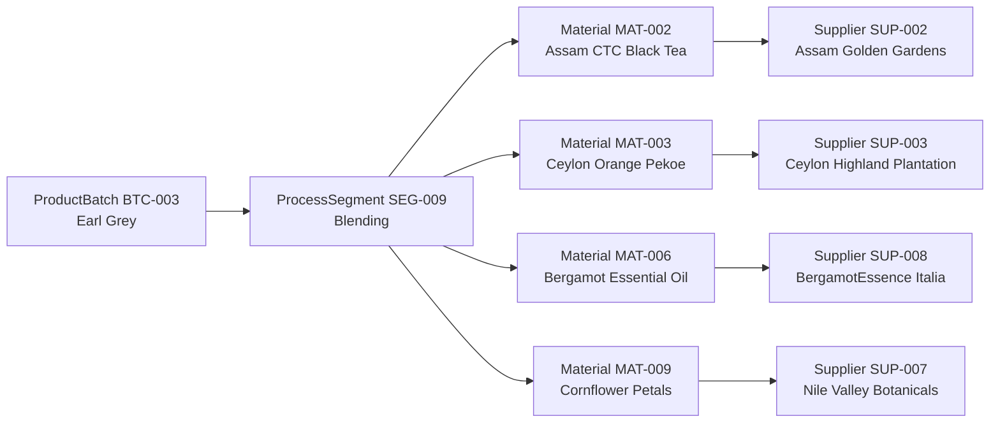
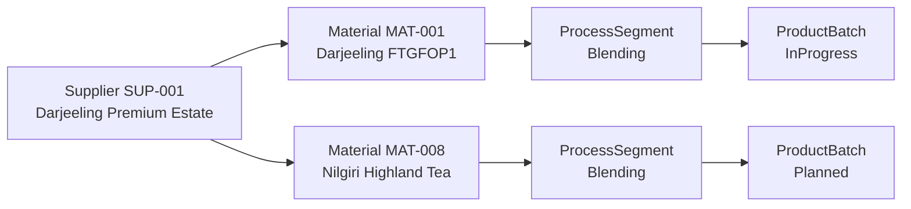
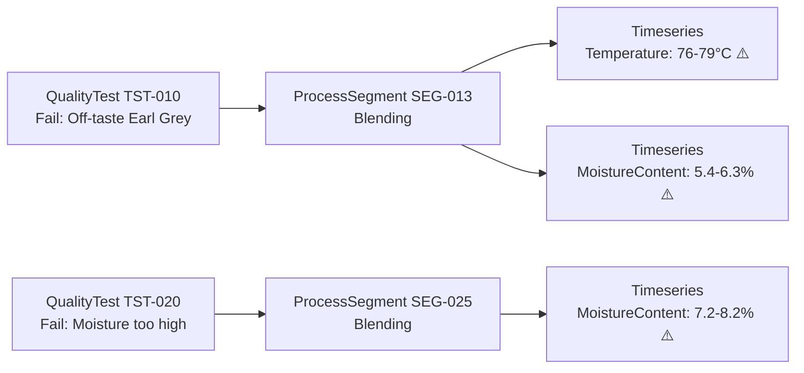
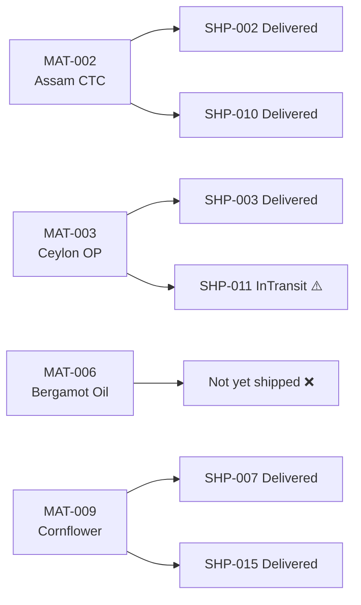

# Demo Questions - Tea Bag Manufacturing (ISA-95 / OPC UA)

This document contains 5 business questions demonstrating graph traversal capabilities for Golden Leaf Tea Co.'s tea bag manufacturing and supply chain ontology.

---

## Question 1: Batch-to-Estate Traceability (3+ Hops)

### Business Question

> "A taste test failure was detected in batch BTC-003 (Earl Grey). Which tea estates and suppliers provided the raw materials used in its blending process?"

### Why It Matters

When a quality issue like an off-taste is discovered in a finished tea batch, tracing back through the blending process to identify the source tea estates is critical for:
- Root cause analysis (stale bergamot, contaminated tea leaves)
- Supplier quality scoring
- Potential batch recall scope assessment
- Fairtrade/Rainforest Alliance compliance auditing

### Graph Traversal

```
ProductBatch (BTC-003) ← ProcessSegment [Blending] → Material [RawMaterial] → Supplier
```



### GQL Query

```gql
MATCH (b:ProductBatch {BatchId: 'BTC-003'})<-[:PRODUCED_IN]-(seg:ProcessSegment {Segment_Type: 'Blending'})-[:USES_MATERIAL]->(m:Material)-[:SUPPLIED_BY]->(s:Supplier)
RETURN DISTINCT s.SupplierId, s.Supplier_Name, s.Supplier_Country, s.Supplier_Rating,
       m.Material_Name, m.Material_Class
```

### Expected Results

| SupplierId | Supplier_Name | Supplier_Country | Supplier_Rating | Material_Name | Material_Class |
|------------|---------------|------------------|-----------------|---------------|----------------|
| SUP-002 | Assam Golden Gardens | India | 4.5 | Assam CTC Black Tea | RawMaterial |
| SUP-003 | Ceylon Highland Plantation | Sri Lanka | 4.8 | Ceylon Orange Pekoe | RawMaterial |
| SUP-008 | BergamotEssence Italia | Italy | 4.9 | Bergamot Essential Oil | RawMaterial |
| SUP-007 | Nile Valley Botanicals | Egypt | 4.4 | Cornflower Petals | RawMaterial |

### Why Ontology is Better

**Traditional Approach**: Requires 4 separate SQL queries with JOINs across DimProductBatch, DimProcessSegment, EdgeSegmentMaterial, DimMaterial, and DimSupplier tables. Complex to write and maintain.

**Ontology Approach**: Single graph traversal expressing the business relationship naturally. The path `ProductBatch ← ProcessSegment → Material → Supplier` matches how quality managers think about traceability.

---

## Question 2: Supply Chain Risk Assessment (4 Hops)

### Business Question

> "If Supplier SUP-001 (Darjeeling Premium Estate) experiences a monsoon disruption, which production batches currently in progress or planned are at risk?"

### Why It Matters

Supply chain disruption analysis requires understanding:
- Which materials come from the affected supplier
- Which process segments use those materials
- Which batches need those segments
- Production timeline impact

### Graph Traversal

```
Supplier (SUP-001) ← Material ← ProcessSegment → ProductBatch [InProgress/Planned]
```



### GQL Query

```gql
MATCH (s:Supplier {SupplierId: 'SUP-001'})<-[:SUPPLIED_BY]-(m:Material)<-[:USES_MATERIAL]-(seg:ProcessSegment)-[:PRODUCED_IN]->(b:ProductBatch)
FILTER b.Batch_Status IN ['InProgress', 'Planned']
RETURN DISTINCT b.BatchId, b.Batch_Product, b.Batch_Status, b.Batch_Quantity,
       COLLECT(DISTINCT m.Material_Name) AS AffectedMaterials
```

### Expected Results

| BatchId | Batch_Product | Batch_Status | Batch_Quantity | AffectedMaterials |
|---------|---------------|--------------|----------------|-------------------|
| BTC-009 | Darjeeling First Flush | Complete | 3000 | [Darjeeling FTGFOP1 Leaves] |
| BTC-010 | Darjeeling First Flush | Complete | 3000 | [Darjeeling FTGFOP1 Leaves] |

> Note: If future Darjeeling batches were planned, they would appear here. The query demonstrates the pattern for any supplier disruption.

### Why Ontology is Better

**Traditional Approach**: 5-table JOIN chain with multiple subqueries to filter by status and aggregate affected materials.

**Ontology Approach**: Natural reverse traversal from supplier through the material → process → batch chain. Immediately shows blast radius of a supplier disruption.

---

## Question 3: Quality-Telemetry Correlation (Mixed Hops + Timeseries)

### Business Question

> "Show the moisture content and temperature readings during the blending process for batches that had failed quality tests. Was there a process anomaly?"

### Why It Matters

Correlating quality test failures with OPC UA sensor telemetry enables:
- Process parameter root cause analysis
- Setting tighter OPC UA alarm thresholds
- Predictive quality: detecting off-spec conditions before taste testing
- ISA-95 production performance analysis

### Graph Traversal

```
QualityTest [Fail] → ProcessSegment → (Timeseries: Temperature, MoistureContent)
```



### GQL Query

```gql
MATCH (qt:QualityTest {Test_Result: 'Fail'})-[:TESTED_IN]->(seg:ProcessSegment)
RETURN qt.TestId, qt.Test_Type, qt.Test_Description,
       seg.SegmentId, seg.Segment_Type,
       seg.Temperature, seg.MoistureContent, seg.CycleTime
ORDER BY qt.Test_Timestamp
```

### Expected Results

| TestId | Test_Type | Test_Description | SegmentId | Segment_Type | Temperature (range) | MoistureContent (range) |
|--------|-----------|------------------|-----------|-------------|-------------------|----------------------|
| TST-010 | TasteTest | Off-taste - stale bergamot | SEG-013 | Blending | 76.0-79.0°C | 5.4-6.3% |
| TST-020 | MoistureAnalysis | Moisture too high at 8.2% | SEG-025 | Blending | 63.8-66.0°C | 7.2-8.2% |
| TST-006 | WeightCheck | Tea bag underweight 2.1g | SEG-006 | Filling | 24.5-25.3°C | 4.8-5.1% |
| TST-022 | VisualInspection | Seal defect - heat bar misaligned | SEG-027 | Sealing | N/A | N/A |

### Insight

SEG-013 shows declining temperature (79→76°C) and rising moisture (5.4→6.3%), explaining the stale bergamot taste. SEG-025 has abnormally high moisture (8.2%), correlating with the chamomile drying failure. These patterns could be caught earlier with OPC UA alarm thresholds.

---

## Question 4: Full Production Genealogy (5 Hops)

### Business Question

> "For batch BTC-001 (English Breakfast), trace the complete production genealogy: all process segments, materials used at each step, their suppliers, and inbound shipments."

### Why It Matters

Complete batch genealogy is required for:
- Food safety regulatory compliance (HACCP, BRC)
- Customer recall response
- Certification audits (Rainforest Alliance, ISO 22000)
- ISA-95 material lot traceability

### Graph Traversal

```
ProductBatch (BTC-001) ← ProcessSegment → Material → Supplier → Equipment
                                           Material ← Shipment → Equipment
```

### GQL Query

```gql
MATCH (b:ProductBatch {BatchId: 'BTC-001'})<-[:PRODUCED_IN]-(seg:ProcessSegment)-[:USES_MATERIAL]->(m:Material)-[:SUPPLIED_BY]->(s:Supplier)
OPTIONAL MATCH (shp:Shipment)-[:SHIPS_MATERIAL]->(m)
RETURN seg.Segment_Type, m.Material_Name, m.Material_Class, s.Supplier_Name, s.Supplier_Country,
       shp.ShipmentId, shp.Shipment_Status
ORDER BY seg.Segment_Type, m.Material_Name
```

### Expected Results (Partial)

| Segment_Type | Material_Name | Material_Class | Supplier_Name | Supplier_Country | ShipmentId | Shipment_Status |
|-------------|---------------|----------------|---------------|------------------|------------|-----------------|
| Blending | Assam CTC Black Tea | RawMaterial | Assam Golden Gardens | India | SHP-002 | Delivered |
| Blending | Ceylon Orange Pekoe | RawMaterial | Ceylon Highland Plantation | Sri Lanka | SHP-003 | Delivered |
| Blending | Kenyan CTC Bold Tea | RawMaterial | Kenyan Highland Tea Corp | Kenya | SHP-010 | Delivered |
| Filling | Heat-Seal Filter Paper | PackagingMaterial | PackRight Solutions GmbH | Germany | SHP-005 | Delivered |
| Filling | Desiccant Sachets | PackagingMaterial | PackRight Solutions GmbH | Germany | SHP-005 | Delivered |
| Sealing | Cotton Tag String | PackagingMaterial | StringCraft Ltd | UK | SHP-009 | Delivered |
| Sealing | Metal Staples | PackagingMaterial | StringCraft Ltd | UK | SHP-009 | Delivered |
| Sealing | Printed Paper Tags | PackagingMaterial | PackRight Solutions GmbH | Germany | SHP-005 | Delivered |
| Packaging | Cardboard Box 20-pack | PackagingMaterial | FlexiPack Industries | USA | SHP-006 | Delivered |
| Packaging | Inner Foil Envelope | PackagingMaterial | PackRight Solutions GmbH | Germany | SHP-005 | Delivered |

### Why Ontology is Better

**Traditional Approach**: 7+ table JOINs across dimension, fact, and edge tables. Extremely complex SQL with subqueries for each processing step.

**Ontology Approach**: Single graph query reconstructs the full production history. The ISA-95 material lot traceability information is naturally expressed as graph paths.

---

## Question 5: Inbound Logistics and Material Provenance (3 Hops)

### Business Question

> "Track all inbound shipments carrying materials destined for Earl Grey production. Which shipments are still in transit and could delay production?"

### Why It Matters

Materials Management in Make (L2) requires visibility into:
- Inbound RMPM management — which shipments carry needed materials
- Material availability for blend scheduling
- Carrier performance and delay risk
- JIT material planning for packing line scheduling

### Graph Traversal

```
Material [used in Earl Grey blending] ← Shipment → Equipment (origin)
```



### GQL Query

```gql
MATCH (seg:ProcessSegment {Segment_Type: 'Blending'})-[:PRODUCED_IN]->(b:ProductBatch {Batch_Product: 'Earl Grey'})
MATCH (seg)-[:USES_MATERIAL]->(m:Material)<-[:SHIPS_MATERIAL]-(shp:Shipment)
OPTIONAL MATCH (shp)-[:ORIGINATED_FROM]->(origin:Equipment)
RETURN m.Material_Name, shp.ShipmentId, shp.Shipment_Status, shp.Shipment_Carrier,
       shp.Shipment_ArrivalDate, origin.Equipment_Name, origin.Equipment_Location
ORDER BY shp.Shipment_Status DESC, shp.Shipment_ArrivalDate
```

### Expected Results

| Material_Name | ShipmentId | Shipment_Status | Shipment_Carrier | Shipment_ArrivalDate | Origin_Equipment | Origin_Location |
|--------------|------------|-----------------|------------------|---------------------|-----------------|-----------------|
| Ceylon Orange Pekoe | SHP-011 | InTransit | CeylonShip Lines | 2025-11-18T16:00:00 | Ceylon Export Terminal | Colombo Sri Lanka |
| Assam CTC Black Tea | SHP-002 | Delivered | IndiaLogistics Express | 2025-10-29T16:00:00 | Assam Processing Mill | Dibrugarh India |
| Assam CTC Black Tea | SHP-010 | Delivered | OceanFreight Global | 2025-11-08T14:00:00 | Assam Processing Mill | Dibrugarh India |
| Ceylon Orange Pekoe | SHP-003 | Delivered | CeylonShip Lines | 2025-10-27T12:00:00 | Ceylon Export Terminal | Colombo Sri Lanka |
| Cornflower Petals | SHP-007 | Delivered | NileAir Cargo | 2025-10-24T10:00:00 | Nile Valley Collection Point | Cairo Egypt |
| Cornflower Petals | SHP-015 | Delivered | NileAir Cargo | 2025-11-12T09:00:00 | Nile Valley Collection Point | Cairo Egypt |

### Insight

SHP-011 (Ceylon Orange Pekoe) is still InTransit, expected 2025-11-18. If this shipment is delayed, Earl Grey batches BTC-012 and BTC-019 may be impacted. The graph makes this supply risk immediately visible.

---

## Bonus: KQL Queries for Real-Scale Telemetry

These queries use the MachineStateTelemetry and ProductionCounterTelemetry tables (20.5M rows total, July 2025 – July 2026).

### 6. Machine Downtime Analysis – Which machines have the most stops?

```kql
MachineStateTelemetry
| where MachineState == "Stopped" and DurationSec > 60
| summarize 
    StopEvents = count(),
    TotalDowntimeMin = round(sum(DurationSec) / 60, 1),
    AvgStopMin = round(avg(DurationSec) / 60, 1)
  by EquipmentId, LineName
| top 15 by TotalDowntimeMin desc
```

### 7. OEE Trend — Daily production efficiency for PackLine-Hotel

```kql
ProductionCounterTelemetry
| where LineName == "PackLine-Hotel" and OEE > 0
| summarize 
    AvgOEE = round(avg(OEE), 2),
    TotalBags = sum(BagCountDelta),
    TotalRejected = sum(BagsRejected)
  by Day = bin(Timestamp, 1d)
| order by Day asc
```

### 8. Shift Comparison — Day vs Night production output

```kql
ProductionCounterTelemetry
| where BagCountDelta > 0
| summarize 
    TotalBags = sum(BagCountDelta),
    AvgOEE = round(avg(OEE), 2),
    Rejected = sum(BagsRejected)
  by Shift
```

### 9. Error Code Hot Spots — Most frequent machine errors

```kql
MachineStateTelemetry
| where ErrorCode != "0" and MachineState != "Running"
| summarize 
    Occurrences = count(),
    AffectedMachines = dcount(EquipmentId),
    AvgDurationSec = round(avg(DurationSec), 0)
  by ErrorCode
| top 20 by Occurrences desc
```

### 10. Cross-Domain: Correlate machine stops with quality failures

```kql
// Find machines that were frequently stopped on dates when quality tests failed
let failDates = datatable(FailDate: datetime) [
    datetime(2025-11-14), datetime(2025-11-15), datetime(2025-11-16), datetime(2025-11-17)
];
MachineStateTelemetry
| where MachineState in ("Stopped", "Blocked")
| where bin(Timestamp, 1d) in (failDates)
| summarize StopEvents = count(), TotalDowntime = sum(DurationSec) by EquipmentId, LineName
| top 10 by StopEvents desc
```

---

## Summary

| Question | Hops | ISA-95 Area | Key Insight |
|----------|------|-------------|-------------|
| 1. Batch-to-Estate Traceability | 3 | Quality Management | Trace failed batch back to source tea estates |
| 2. Supply Chain Risk | 4 | Materials Management | Monsoon disruption blast radius |
| 3. Quality-Telemetry Correlation | 2 + TS | Quality + Shop Floor Control | OPC UA sensor data explains quality failures |
| 4. Full Production Genealogy | 5 | All L2 areas | Complete HACCP/BRC audit trail |
| 5. Inbound Logistics | 3 | Materials Management | In-transit delays threatening production |
| 6. Machine Downtime Analysis | KQL | Shop Floor Control | Identify worst-performing machines |
| 7. OEE Trend | KQL | Shop Floor Control | Daily production efficiency tracking |
| 8. Shift Comparison | KQL | Shop Floor Control | Day vs Night output comparison |
| 9. Error Code Hot Spots | KQL | Plant Maintenance | Most frequent machine errors |
| 10. Cross-Domain Correlation | KQL + GQL | Quality + Shop Floor | Machine stops on quality-failure days |
