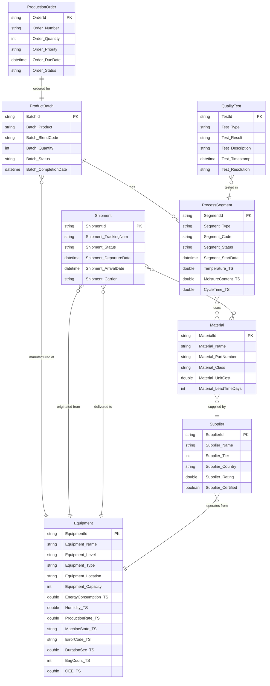

# Ontology Structure - Tea Bag Manufacturing (ISA-95 / OPC UA)

## Overview

This ontology models a tea bag manufacturing ecosystem for **Golden Leaf Tea Co.**, aligned with ISA-95 (IEC 62264) equipment hierarchy and OPC UA information model concepts. It covers the **Make & Quality** process (L1) including:

- **L2 Process Areas**: Blend Scheduling, Tea Blending, Packing Line Scheduling, Packing Execution, Quality Management, Shop Floor Control, Materials Management in Make, Plant Maintenance
- **L3 Activities**: Blend Order Management, 3rd Party Tea Picking, Materials Staging, Packing Line Order Mgmt, Production Confirmation, Material Quality, SFG/FG Quality, QMS Audits & Certifications

The ontology enables end-to-end traceability from tea estates through blending and packing to finished goods distribution.

---

## Entity Definitions

| Entity | Key | Key Type | ISA-95 Concept | Description | Binding Source |
|--------|-----|----------|----------------|-------------|----------------|
| **ProductBatch** | BatchId | string | Material Lot / Product Batch | A production batch of finished tea bags | Lakehouse: DimProductBatch |
| **ProcessSegment** | SegmentId | string | Process Segment | Manufacturing step: Blending, Filling, Sealing, Packaging | Lakehouse: DimProcessSegment, Eventhouse: ProcessSegmentTelemetry |
| **Material** | MaterialId | string | Material Definition | Raw materials (tea, herbs) and packaging materials (filter paper, boxes) | Lakehouse: DimMaterial |
| **Supplier** | SupplierId | string | External Provider | Tea estates, herb farms, and packaging suppliers | Lakehouse: DimSupplier |
| **Equipment** | EquipmentId | string | Equipment (Site/Area/WorkCenter/WorkUnit) | ISA-95 hierarchy: blenderies, packing lines, labs, warehouses, 134 individual machines | Lakehouse: DimEquipment, Eventhouse: EquipmentTelemetry, MachineStateTelemetry, ProductionCounterTelemetry |
| **ProductionOrder** | OrderId | string | Production Schedule | Work orders for tea bag production runs | Lakehouse: DimProductionOrder |
| **QualityTest** | TestId | string | Quality Test Operations | Taste tests, weight checks, moisture analysis, contamination tests | Lakehouse: FactQualityTest |
| **Shipment** | ShipmentId | string | Logistics | Inbound raw materials and outbound finished goods | Lakehouse: FactShipment |

---

## Entity Properties

### ProductBatch
| Property | Type | Description |
|----------|------|-------------|
| BatchId | string | Unique batch identifier |
| Batch_Product | string | Tea product name (e.g., English Breakfast, Earl Grey) |
| Batch_BlendCode | string | Blend recipe code from master data (ISA-95 Product Definition) |
| Batch_Quantity | int | Number of tea bags in batch |
| Batch_Status | string | Status (Planned, InProgress, Complete, Shipped) |
| Batch_CompletionDate | datetime | Completion timestamp |

### ProcessSegment
| Property | Type | Description |
|----------|------|-------------|
| SegmentId | string | Unique segment identifier |
| Segment_Type | string | ISA-95 L2 process: Blending, Filling, Sealing, Packaging |
| Segment_Code | string | Process segment reference code from routing |
| Segment_Status | string | Status (Pending, InProgress, Complete, QCPassed) |
| Segment_StartDate | datetime | Segment start timestamp |
| *Temperature* | double | *(Timeseries)* Process temperature in °C. OPC UA: `ns=2;s=Segment.Temperature` |
| *MoistureContent* | double | *(Timeseries)* Moisture content %. OPC UA: `ns=2;s=Segment.MoistureContent` |
| *CycleTime* | double | *(Timeseries)* Cycle time in seconds. OPC UA: `ns=2;s=Segment.CycleTime` |

### Material
| Property | Type | Description |
|----------|------|-------------|
| MaterialId | string | Unique material identifier |
| Material_Name | string | Material name (e.g., Assam CTC Black Tea, Heat-Seal Filter Paper) |
| Material_PartNumber | string | ISA-95 Material ID / Part number |
| Material_Class | string | ISA-95 material class: RawMaterial, PackagingMaterial, IntermediateProduct |
| Material_UnitCost | double | Cost per unit (kg or piece) |
| Material_LeadTimeDays | int | Supplier lead time in days |

### Supplier
| Property | Type | Description |
|----------|------|-------------|
| SupplierId | string | Unique supplier identifier |
| Supplier_Name | string | Company name |
| Supplier_Tier | int | Tier level: 1 = direct (tea estates), 2 = indirect (packaging) |
| Supplier_Country | string | Country of origin |
| Supplier_Rating | double | Quality rating (0-5) |
| Supplier_Certified | boolean | Rainforest Alliance / Fairtrade certification |

### Equipment
| Property | Type | Description |
|----------|------|-------------|
| EquipmentId | string | Unique equipment identifier |
| Equipment_Name | string | Equipment name |
| Equipment_Level | string | ISA-95 hierarchy: Site, Area, WorkCenter, WorkUnit |
| Equipment_Type | string | Function: Blending, Packing, Forming, Wrapping, Transport, QualityControl, Distribution, Warehouse, Supplier |
| Equipment_Location | string | City, Country |
| Equipment_Capacity | int | Annual capacity (kg for blending, bags for packing) |
| *EnergyConsumption* | double | *(Timeseries - EquipmentTelemetry)* Energy usage kWh. OPC UA: `ns=2;s=Equipment.EnergyConsumption` |
| *Humidity* | double | *(Timeseries - EquipmentTelemetry)* Relative humidity %. OPC UA: `ns=2;s=Equipment.Humidity` |
| *ProductionRate* | double | *(Timeseries - EquipmentTelemetry)* Production rate bags/hr. OPC UA: `ns=2;s=Equipment.ProductionRate` |
| *MachineState* | string | *(Timeseries - MachineStateTelemetry)* Running, Stopped, Blocked, Waiting, Idle. OPC UA: `ns=2;s=Equipment.State.MachineState` |
| *ErrorCode* | string | *(Timeseries - MachineStateTelemetry)* PLC alarm/error code. OPC UA: `ns=2;s=Equipment.State.ErrorCode` |
| *DurationSec* | double | *(Timeseries - MachineStateTelemetry)* State duration in seconds. OPC UA: `ns=2;s=Equipment.State.DurationSec` |
| *BagCount* | int | *(Timeseries - ProductionCounterTelemetry)* Cumulative bag count. OPC UA: `ns=2;s=Equipment.Counter.BagCount` |
| *BagCountDelta* | int | *(Timeseries - ProductionCounterTelemetry)* Incremental bags since last reading. OPC UA: `ns=2;s=Equipment.Counter.BagCountDelta` |
| *TeaProducedGram* | double | *(Timeseries - ProductionCounterTelemetry)* Tea produced in grams. OPC UA: `ns=2;s=Equipment.Counter.TeaProducedGram` |
| *BagsRejected* | int | *(Timeseries - ProductionCounterTelemetry)* Bags rejected. OPC UA: `ns=2;s=Equipment.Counter.BagsRejected` |
| *OEE* | double | *(Timeseries - ProductionCounterTelemetry)* Overall Equipment Effectiveness %. OPC UA: `ns=2;s=Equipment.Counter.OEE` |
| *VOT* | double | *(Timeseries - ProductionCounterTelemetry)* Valuable Operating Time seconds. OPC UA: `ns=2;s=Equipment.Counter.VOT` |
| *LoadingTime* | double | *(Timeseries - ProductionCounterTelemetry)* Loading Time seconds. OPC UA: `ns=2;s=Equipment.Counter.LoadingTime` |

### ProductionOrder
| Property | Type | Description |
|----------|------|-------------|
| OrderId | string | Unique order identifier |
| Order_Number | string | Order reference number |
| Order_Quantity | int | Ordered quantity of tea bags |
| Order_Priority | string | Priority (Normal, High, Rush) |
| Order_DueDate | datetime | Target completion date |
| Order_Status | string | Status (Planned, InProgress, Complete) |

### QualityTest
| Property | Type | Description |
|----------|------|-------------|
| TestId | string | Unique test identifier |
| Test_Type | string | Type: TasteTest, WeightCheck, MoistureAnalysis, ContaminationTest, Audit, VisualInspection |
| Test_Result | string | Result: Pass, Fail, ConditionalPass |
| Test_Description | string | Description of test |
| Test_Timestamp | datetime | When test was performed |
| Test_Resolution | string | Resolution outcome |

### Shipment
| Property | Type | Description |
|----------|------|-------------|
| ShipmentId | string | Unique shipment identifier |
| Shipment_TrackingNum | string | Tracking number |
| Shipment_Status | string | Status (Pending, InTransit, Delivered, Customs) |
| Shipment_DepartureDate | datetime | Departure timestamp |
| Shipment_ArrivalDate | datetime | Expected/actual arrival |
| Shipment_Carrier | string | Logistics carrier name |

---

## Relationships

| Relationship | Source Entity | Target Entity | Cardinality | Source Table |
|--------------|---------------|---------------|-------------|--------------|
| PRODUCED_IN | ProcessSegment | ProductBatch | Many-to-One | DimProcessSegment |
| USES_MATERIAL | ProcessSegment | Material | Many-to-Many | EdgeSegmentMaterial |
| SUPPLIED_BY | Material | Supplier | Many-to-One | DimMaterial |
| MANUFACTURED_AT | ProductBatch | Equipment | Many-to-One | DimProductBatch |
| ORDERED_FOR | ProductionOrder | ProductBatch | One-to-One | DimProductionOrder |
| TESTED_IN | QualityTest | ProcessSegment | Many-to-One | FactQualityTest |
| ORIGINATED_FROM | Shipment | Equipment | Many-to-One | EdgeShipmentOrigin |
| DELIVERED_TO | Shipment | Equipment | Many-to-One | EdgeShipmentDestination |
| SHIPS_MATERIAL | Shipment | Material | Many-to-Many | EdgeShipmentMaterial |
| OPERATES_FROM | Supplier | Equipment | Many-to-One | DimSupplier |

---

## Entity Relationship Diagram



---

## ISA-95 Process Hierarchy Mapping

```
L0: Supply Chain
└── L1: Make & Quality
    ├── L2: Blend Scheduling      → (ProductionOrder, ProductBatch)
    ├── L2: Tea Blending          → ProcessSegment [Type=Blending]
    ├── L2: Packing Line Sched.   → (ProductionOrder)
    ├── L2: Packing Execution     → ProcessSegment [Type=Filling, Sealing, Packaging]
    ├── L2: Quality Management    → QualityTest
    ├── L2: Shop Floor Control    → (Equipment telemetry)
    ├── L2: Materials Mgmt        → Material, Shipment, EdgeSegmentMaterial
    └── L2: Plant Maintenance     → (Equipment)
```

## OPC UA Information Model Mapping

| OPC UA Concept | Ontology Mapping |
|----------------|-----------------|
| Server / Namespace | `ns=2;s=GoldenLeafTea` |
| Equipment Node | Equipment entity |
| Process Variable | Timeseries properties (Temperature, MoistureContent, etc.) |
| Tag Path | OPC UA NodeId in TTL comments |
| Subscription / PubSub | Eventhouse telemetry ingestion |
